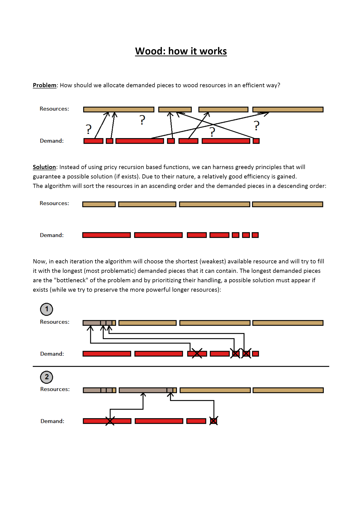
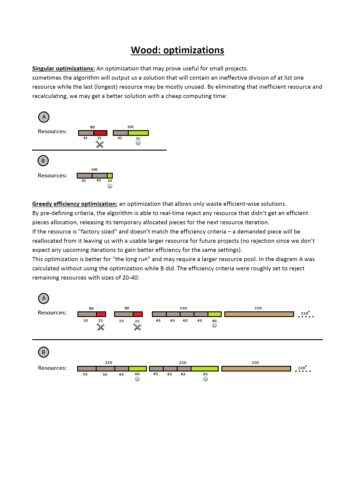

# Wood
An android application designed to allocate wood resources for a small carpentry business.

#### Problem: 
it is hard to efficiently divide size-varying wood resources into smaller pieces required for carpentry projects.

#### Solution:
the Wood app implements an algorithm that manages to do just that with a relatively good efficiency.  

#### screenshots:
     
 
#### The "long-run" toggle button:
Off- tries to find a solution that uses as little valuable long wood resources as possible, good for sole projects.  
On- tries to find a solution that will allow only efficient divisions at a probable cost of more valuable long wood resources, good for unknown future projects.  

#### Algorithm explanation:

 
  
 

